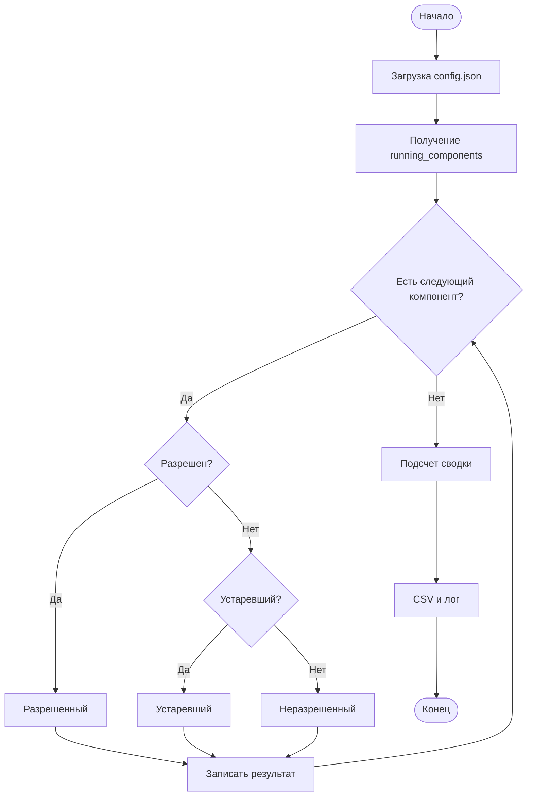

```mermaid
flowchart TD
A([Начало]) --> B[Загрузка config.json]
B --> C[Получение running_components]
C --> D{Есть следующий компонент?}
D -- Нет --> H[Подсчет сводки]
D -- Да --> E{Разрешен?}
E -- Да --> F[Разрешенный]
E -- Нет --> G{Устаревший?}
G -- Да --> I[Устаревший]
G -- Нет --> J[Неразрешенный]
F --> K[Записать результат]
I --> K
J --> K
K --> D
H --> L[CSV и лог]
L --> M([Конец])
```